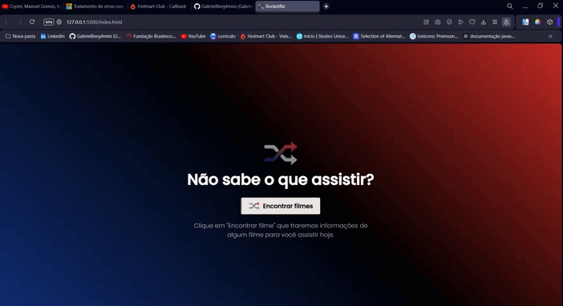
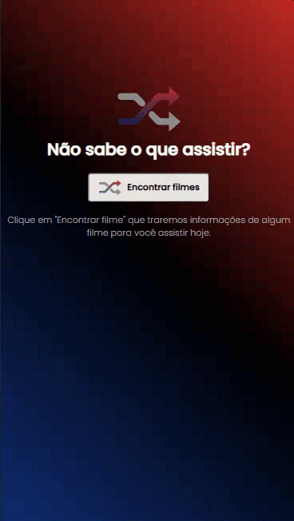

# Rocketflix

> Status: finished.

### I developed this project as a challenge proposed by rocketseat, I used only html, css, javascript and the consumption of an API (the movie) to accomplish it.

### result DeskTop:

    

### result Mobile:

    

## Project developed with HTML, CSS, Git, JavaScript and API (the movie).

API used in the challenge: https://www.themoviedb.org/
